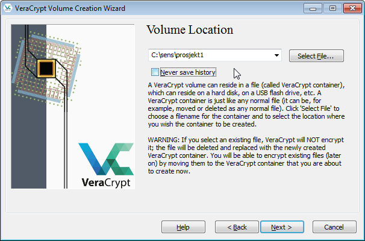
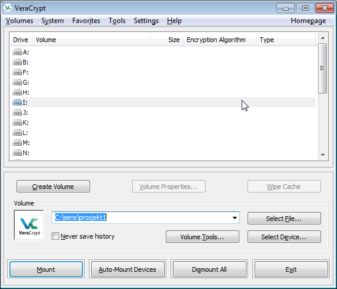
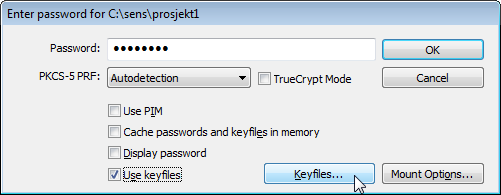
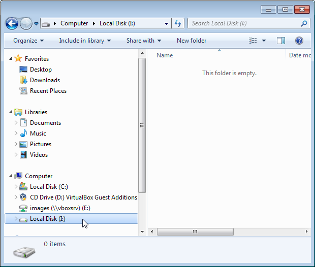
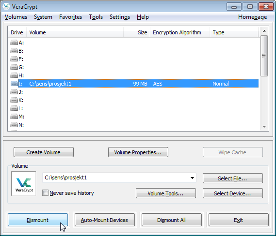

# Brukerveiledning
En forutsetning for effektivt analysearbeid vil ofte være å
kunne jobbe med data på lokal datamaskin. Når dette gjelder
sensitive data skal disse krypteres ved lagring også hos
brukeren. Dette er en forutsetning for å gi en tilstrekkelig
beskyttelse mot uautorisert innsyn i data, for eksempel ved tyveri,
og som et tiltak for rent praktisk å kunne slette alle data når disse
har en begrenset gyldighetsperiode.


## Oppsett og bruk av kryptering på lokale lagringsmedier
Lagring av sensitive data på egen datamaskin eller andre
lokal lagringsmedier (_e.g._ CD, minnepinne)
skal skje kryptert slik at den bare kan leses av den som har riktig
nøkkel. Sensitive data vil derfor ikke kunne falle uvedkommende i hende
hvis lagringsmediet kommer på avveie ved for eksempel tap eller
tyveri. I tillegg vil man kunne oppnå effektiv sletting av data
ved at respektiv nøkkel slettes.

Flere vertøy kan brukes for å oppnå lokal kryptering av
data. Her er det tatt utgangspunkt i
[VeraCrypt](https://veracrypt.codeplex.com/)


### Last ned og installér VeraCrypt
_VeraCrypt_ er fri og åpen programvare og kan lastes ned gjennom
lenken som er angitt [her](https://veracrypt.codeplex.com/). Velg
riktig variant i forhold til ønsket operativsystem,
her vist for _Windows 7/Vista/XP/2000_ med
versjon 1.21 av _VeraCrypt_.

```{block2, vc-install, type='rmdimportant'}
Intallasjon av _VeraCrypt_ krever adminstratorrett til datamaskinen som installasjonen
foretas på. Hvis man fra før ikke har (lokal) administratortilgang er
man nødt til å be HNIKT om hjelp til installasjonen
```

Kjør den nedlastede fila og godta lisensvilkårene. I det neste
vinduet velges _Install_ og trykk deretter på
_Next_. Følgende vindu skal da komme opp:

```{r vc1, echo=FALSE, fig.cap='Installasjon av VeraCrypt.', out.width = '50%', fig.align='center'}
knitr::include_graphics('images/vc1.png')
```

Installasjonsprogrammet foreslår en plassering av programmet,
og med mindre det fins gode grunner til å gjøre det motsatte,
godta det som er valgt. Avhengig av de privilegier man har som
bruker av sin egen datamaskin, kan man velge å installer
_VeraCrypt_ for alle brukere (første avkryssningsalternativ i Figur
\@ref(fig:vc1)). Trykk deretter _Install_. Om alt gikk riktig for
seg får man et nytt vindu med teksten "VeraCrypt has been successfully
installed". Trykk _OK_.


```{block2, vcdoc-text, type='rmdinfo'}
Det er mulig det ved slutten av installasjonen gis tilbud om
å lese dokumentasjon på _VeraCrypt_, og det er
vel anvendt tid å gjøre. Ved seinere behov fins denne
dokumentasjonen
[tilgjengelig på nettsida](https://veracrypt.codeplex.com/documentation)
der programmet lastes ned fra.
```

### Oppsett av VeraCrypt
_VeraCrypt_ kan benyttes på mange vis,
og denne veilednigen er ikke uttømmende men beskriver typisk bruk
ved SKDE. Ved behov utover dette må man lese tilgjengelig
dokumentasjon samt konferere med andre brukere.

```{block2, vc-about, type='rmdimportant'}
Etter riktig oppsett av _VeraCrypt_ krypteres informasjon ved å lagre data
til en disk som _VeraCrypt_ har satt opp. _VeraCrypt_ kaller dette for et
_volum_ eller _diskvolum_
og vil for eksempel i _Windows_ framstå som
hvilken som helst annen disk med en egen bokstav
(_e.g. I:\\_). Det som skjer under oppsett
av et _VeraCrypt_ volum er at ei fil
med definert størrelse blir satt av på et angitt lagringsmedie.
_VeraCrypt_ kaller denne fila for en kryptert
filkontainer og det er denne fila som inneholder krypterte data. Ved
oppstart monterer _VeraCrypt_ denne fila som et volum som
det da er mulig å skrive til (lagre) og lese fra (åpne).
```

Følgende viser et oppsett av en kryptert disk på 100 Mb
(i mange tilfeller vil det være behov for å sett av mer plass).
Ved oppstart av _VeraCrypt_ vil man se
vinduet vist i figur \@ref(fig:vc2).

```{r vc2, echo=FALSE, fig.cap='Oppsett av ny kryptert disk.', out.width = '50%', fig.align='center'}
knitr::include_graphics('images/vc2.png')
```

Trykk på _Create volume_. I påfølgende vindu
(ikke vist) velges _Create an encrypted file container_
og trykk _Next_. I vinduet deretter
        velg _Standard VeraCrypt volume_ og trykk
        _Next_. Da skal man se vinduet vist i figur \@ref(fig:vc3).
        
```{r vc3, echo=FALSE, fig.cap='Oppsett av kryptert filkontainer.', out.width = '50%', fig.align='center'}

```

Her definerer man den krypterte filkontaineren, i dette tilfellet
_C:\\sens\\prosjket1_. Fjern avkryssing for _Never save history_ og
trykk _Next_. I det påfølgende vinduet, trykk
_Next_ uten å endre på det som
installasjonsprogrammet har foreslått av innstillinger.
        
```{block2, vcalgo, type='rmdinfo'}        
Kryptoalgoritmen som benyttesom standard i _VeraCrypt_ er _AES-256_ som gir
god nok beskyttelse for sensitive data som SKDE er befatning
med. Det er derfor ingen grunn til ikke å velge standard instilling her.
```

Deretter angis størrelsen på det nye krypterte diskvolumet, eksempelvis slik
det er vist i \@ref(fig:vc4).


```{r vc4, echo=FALSE, fig.cap='Definisjon av volumstørrelse', out.width = '50%', fig.align='center'}
knitr::include_graphics('images/vc4.png')
```

Trykk _Next_. I påfølgende vindu velger (og bekrefter) man et sterkt passord
(åtte tegn bestående av store og små bokstaver, tall og spesialtegn) og krysser
av for _Use keyfiles_ slik det er vist i \@ref(fig:vc5).

```{r vc5, echo=FALSE, fig.cap='Definisjon av passord.', out.width = '50%', fig.align='center'}
knitr::include_graphics('images/vc5.png')
```

Trykk på _Keyfiles..._. I det neste vinduet (ikke vist) trykker man på
_Generate Random Keyfile..._. Følg installasjonsveilederen for å lage
nøkkelfila som deretter lagres på et egnet sted.
        
```{block2, vckey, type='rmdimportant'}        
Ta godt vare på nøkkelen. Om den endres eller mistes, så vil alle data som er
kryptert ved hjelp av denne nøkkelen være tapt for alltid. Ikke la nøkkelen
ligge på samme lagringsmedie som de krypterte data. En god plassering av
nøkkelen vil for SKDE sine ansatte være på personlig område på
nettverksdisk (_P:\\_). Da er nøkkelen skilt fra data
(som ligger på på lokal disk) samt at den er bedre sikret i forhold til
tap som for eksempel ved diskfeil.
```

Trykk _Close_ i vinduet _VeraCrypt - Keyfile Generator_ (ikke vist). Tilbake i
vinduet _VeraCrypt - Keyfiles_ (ikke vist), trykk _Add files..._ og velg deretter
nøkkelfila som nettopp ble laget og trykk _OK_.
Tilbake i vinduet vist i \@ref(fig:vc5), trykk _Next_.
        
```{block2, vcpassword, type='rmdinfo'}
Som standard brukes oppgitt passord som utgangspunkt for kryptovariabel i
_VeraCrypt_. Ved en
        slik tilnærming vil et vanlig stertkt passord (åtte tegn bestående av
        store og små bokstaver, tall og spesialtegn) være utilstrekkelig for
        å oppnå en sterk nok kryptering. Dette vil man nå kunne få en advarsel
        om, men så lenge en nøkkelfil og et stertkt passord er definert kan
        man ignorere denne advarselen.
  ```


I det nest vinduet velger man _FAT_ under _Filesystem_ og trykker _Format_
slik vist i \@ref(fig:vc6).

```{r vc6, echo=FALSE, fig.cap='Formatering av diskvolum.', out.width = '50%', fig.align='center'}
knitr::include_graphics('images/vc6.png')
```

Når filkontaineren er ferdig formatert vil man få en
        bekreftelse på at dette er gjennomført slik vist i
        \@ref(fig:vc7).

```{r vc7, echo=FALSE, fig.cap='Formatering av OK.', out.width = '50%', fig.align='center'}
knitr::include_graphics('images/vc7.png')
```

Trykk _OK_ og deretter _Exit_ i det neste vinduet.


### Oppstart av VeraCrypt
Start programmet _VeraCrypt_ og angi stasjonsbokstav
(_i.e._ monteringspunkt) og tilhørende filkontainer slik det er vist i
\@ref(fig:vc8). Her er stasjonsbokstav angitt som _I:\\_ og fikontainer er
_C:\\sens\\prosjekt1_.

```{r vc8, echo=FALSE, fig.cap='Montering av diskvolum', out.width = '50%', fig.align='center'}

```

Trykk på _Mount_. Deretter angis passord og nøkkelfil slik det er vist i figur
\@ref(fig:vc9).

```{r vc9, echo=FALSE, fig.cap='Definisjon av passord og nøkkelfil', out.width = '50%', fig.align='center'}

```

Når man trykker _Keyfiles..._ vil man i
neste vindu (ikke vist) velges riktig nøkkelfil ved å trykke på
_Add files..._. Trykk deretter _OK_. Tilbake i vinduet vist i figur
\@ref(fig:vc9) trykker man _OK_. Deretter skal man kunne se
at en ny disk er lagt til (figur \@ref(fig:vc10)).

```{r vc10, echo=FALSE, fig.cap='Kryptert diskvolum er satt opp.', out.width = '50%', fig.align='center'}

```

Det nye _VeraCrypt_ diskvolumet er nå klart til bruk, på samme vis som
hvilken som helst annen disk. Alle filer som skrives hit, i dette tilfellet
_I:\\_, vil krypteres før de lagres og filer som leses herfra
dekrypteres før de åpnes.

For å gjøre diskvolumet utilgjengelig må det avmonteres. Merk
aktuell stasjonsbokstav og trykk på _Dismount_
slik det er vist i figur \@ref(fig:vc11).

```{r vc11, echo=FALSE, fig.cap='Avmontering av diskvolum.', out.width = '50%', fig.align='center'}

```

Oppsett og bruk vil være tilsvarende om man ønsker å bruke
_VeraCrypt_ til å kryptere data på andre lagringsmedier, som for eksempel en
minnepinne. For bruk av minnepinne vil det være uhensiktsmessig å benytte en
separat nøkkel, men da må man velge et passord som gir mer beskyttelse og som
er i henhold til de anbefalinger _VeraCrypt_ gir.
Sletting av data på minnepinne må derfor også håndteres særlig siden
det ikke fins noen nøkkel som kan slettes. Her bør man prøve seg
frem og spør gjerne andre med erfaring fra bruk av
_VeraCrypt_.